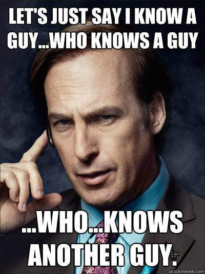

# Mentoring

*...At least, what I've learned so far...*

<!-- 
_class: invert
_footer: Josh Schneider •  [@dijital20](https://github.com/dijital20) / [talk-mentoring](https://github.com/dijital20/talk-mentoring) •  [mastodon.social/@diji](https://mastodon.social/@diji)
-->

---

## How I got here

<!-- Speaker Notes:

I'm Josh. I'm 46. I have no degree.

In my career, I have been a salad bar maintainer, support specialist, customer advocate, product owner, test automation architect, and application security engineer.

Most of my success has been from cool people who took the time to sit down with me and give me advice, tell me the dumb stuff I just did, and challenge me to do more than I thought I could. People like Craig, Charles, Jean-Paul, Jim, Joe, Salty, Darrell, Scot, Brad, Keoki, Courtney, James, Brian, Mike, Stubbs... and the list goes on.

 -->

---

### A quick thanks...

Josey • Sameer • Peres • Ariana • Mara • Anusri • Hailey

<!-- Speaker Notes:

Shout out to the great people I've gotten to mentor in my time.

 -->

---

## How mentoring starts...

<!-- 
_class: invert
-->

---

### *"Mentor, I choose you!"*


<!-- Speaker Notes:

This is how I prefer mentor relationships, and what should be the most common. In this model, the mentee approaches the mentor because the mentor has some attribute(s) that the mentee wants within themselves. They ask the mentor to train them.

I like this model because:

1. It's clear what the mentee wants from the mentor.
2. It's clear that the mentee has chosen the mentor.

This is the "willing student" model. You get all of the awkwardness out of the way... chances are that you are at least acquainted, if not known to each other. You can dial into what they want, and they chose to be here, so they want what you have. There's less doubt this way and probably more social connective tissue that you want to do a good job for each other.

 -->

---

### *"I know someone you can talk to..."*



<!-- Speaker Notes:

This, at least in my experience, is more common. This is where a third party connects the mentee with the mentor. The most common example is when you mentor a college intern, or if you are connected through a mentoring program.

In this model, you are less likely to know each other. The mentee isn't usually sure what they want from the mentor, so your relationship is initially anchored to whatever program connected you. 

By no means does it need to stay that way... one of the most interesting parts of this model is that you get to discover each other along the way, and although your connection takes more work and can be a mixed bag, you also have the most potential for discovering something new and interesting in the time you have.

 -->

---

## Session 0

<!--
_class: invert
-->

<!-- Speaker Notes:

Session 0 is my first meeting with my mentee. The purpose of Session 0 is to set the baseline for our relationship. My goals are:

1. Get to know the mentee and their goals.
2. Impart the most important, most foundational piece of advice.
3. Set the expectations for the relationship
4. Build trust

 -->

---

*Listen*

<!-- Speaker Notes:

Start by listening to what they want. When its time to speak, let's get to the important bits.

 -->

---

> ***You*** have to own your decisions.

<!-- Speaker Notes:

My job is to provide advice. What you do with it is on you. Agency is the most important tool you will ever wield, and the best skill to build. At the end of any given day, you have to look at your face in the mirror, and be okay with who you are.

 -->

---

> I have a perspective, and that perspective is not unbiased.

<!-- Speaker Notes:

I am here to provide advice and experience, but my perspective is biased. I am a white guy, so your mileage may vary. In addition to me, seek out other mentors, friends, and advice givers. For any given big decision, have 5-10 people you trust to give you honest advice, and then look at where those perspectives converge and diverge. Regardless of what you are told, at the end of the day you have to own what you do.

 -->

---

> Neither of us are perfect, we will both ⁉️🤬🙅💥 up.

<!-- Speaker Notes:

Neither of us are perfect. We'll mess up.

People don't remember the mess up as much as they remember how you responded to it. You have to handle what happens, do your best to respond as well as possible.

If I mess up, call me on it.

 -->

---

> Don't waste time on people who won't at least try to meet you where you are.

<!-- Speaker Notes:

If I don't fix it, then I may not be worth your time. Don't waste your time with people who won't at least try to meet you where you are.

 -->

---

> Be a good human first, and a good teammate/employee second.

<!-- Speaker Notes:

Speaks for itself. 

"Don't try to be a great man (person). Just try to be a man (person) and let history make its own judgements."
 -- Cmdr. William Riker, Star Trek: First Contact

 -->

---

### My job as a mentor is to...

* ...listen
* ...provide advice
* ...connect you to people and resources
* ...hold ***you*** accountable to ***your*** goals
* ...occasionally, hopefully, inspire you

<!-- 
_class: noBullets 
-->

<!-- Speaker Notes:

My job is to do the following:
- Listen. I'm your sounding board if you need it. I'm here for your questions, complaints, rants, and raves.
- I provide advice. This part is easy. What worked for me. Remember, it's biased, so YMMV.
- Connect you with people and resources that may help. I feel like this gets overlooked by some mentors, but it doesn't all come from me. Sometimes I don't have an answer, but I can probably introduce you to someone who has a perspective. Or maybe I have an article for you to read. Sometimes I'll tell you to watch an episode of Ted Lasso or Star Trek because I think there's something there to learn.
- Hold you accountable to your goals... remember, you are in the driver's seat. These are your goals we're trying to reach, so I'm going to poke on you about what you're doing, how you're doing, and ask you annoying questions like whether you're being honest with yourself. Sometimes this will annoy you. Sorry.
- Hopefully, I get to inspire. That's always fun.

 -->

---

## Universal Knowledge

⬆️ ⬆️ ⬇️ ⬇️ ⬅️ ➡️ ⬅️ ➡️ 🅱️ 🅰️ 🅱️ 🅰️

<!--
_class: invert
-->

<!-- Speaker Notes:

If there was ever a cheat code for success, this is the closest I've found to it.

 -->

---

## Reputation

<!--
_class: invert
-->

---

Your reputation walks into the room before you do and talks about you.

Don't let that apparition talk 💩!

<!-- Speaker Notes:

I've heard the term "personal brand", and if that works for you, alright. Honestly, makes me throw up in my mouth a bit, but you do you.

Your reputation is a ghost, a reflection of you that walks into the room before you do. Its in your best interest to not have it talking smack about you.

 -->

---

```python

reputation = (
    sum(positive_experiences)
    + (sum(negative_experiences) * negative_exp_coef)
) * proximity_to_speaker

```

<!-- Speaker Notes:

If I were to model what reputation is, it's this:

The sum of all good experiences, added to the sum of all bad experiences times the negative experience coefficient, multiplied by your proximity to speaker or recipient.

In short, it's all the good stuff plus all the bad stuff (and then some) times how well the person talking about you knows you. Let's break it down...

 -->

---

### Proximity Matters

Proximity of the speaker or receiver adds or removes credibility.

The closer the speaker or recipient is, the more *"real"* your reputation is.

<!-- Speaker Notes:

First, the last part. Whether your reputation is coming through your resume, your LinkedIn profile, the sum of some subset of your social media footprint, or people; how close they are to you, how much they really know you, and how much they care factors into this.

Likewise, the proximity of the speaker to the receipient plays a role.

For instance... I walked into an interview a while back and found that everyone in the room already had an idea about this. I was recommended to apply for this job by my friend Scot, who I'd worked with previously. Everyone on the interview panel had heard about me already from Scot.

First off, Scot had told them a lot of positive things about me. They were interested. They asked questions. They exhibited positive body language when I completely nerded out about a project I'd recently worked on. In no small part do I think that Scot's representation of me primed them for what to expect, and I was able to deliver.

More than that, I also learned that people really listened to Scot and valued his opinion.. so not only was someone saying a lot of very good things about me, but they took that very seriously based on who was delivering it.

So... who is talking about you is as important as what they're saying. The more credible and the more real it is, the more strongly it's taken.

 -->

---

### Positive experiences help

How much depends on how meaningful they are to the speaker.

They decay faster than negative experiences.

<!-- Speaker Notes:

People remember the good that you do. Huzzah! Do more good things. People remember those good things... for a while. Eventually, you get "that was yesterday, what have you done for me today?". You have to refresh the good things regularly... keep a steady pipeline of them.

 -->

---

### Negative experiences hinder

How long they linger and how strong they are depend on how meaningful they are to the speaker.

They decay much slower; bad news is remembered longer than good news.

<!-- Speaker Notes:

Negative experiences hinder you... duh, but also, they have hang time! Negative experiences linger for a long while. While people forget the good thing you did for them, they remember that one time you messed up. How strong and how long depends on how bad it was to the person remembering it.

Bad news remains, and remember this...

 -->

---

#### Remember, you will ⁉️🤬🙅💥 up!

People usually remember your response (and how it made them feel) far more than they remember what happened.

Good response dulls a negative experience, bad response magnifies it.

<!-- Speaker Notes:

You're gonna mess up! Failure is a visitor that will drop in, often unannounced, and be the most annoying houseguest. Seriously, like the "pack up and move with no forwarding address" kinda houseguest (don't worry, they'll find you wherever you go).

THe thing is, people won't rememmber the failure as much as how you made them feel... but that's important, because it means you can change the odds, and bend a bad experience into a more positive direction.

 -->

---

#### Survival Guide to ⁉️🤬🙅💥ing Up

1. Take a breath and give yourself some grace
2. Triage and Stabilize
3. Identify where things went wrong and why
4. Identify what you will do different next time
5. Make it right (to the best of your ability)

<!-- Speaker Notes:

You can survive failing. It's possible. Here's what's worked for me:

1. Take a breath and give yourself some grace
What's happened has happened and you can't change that. Don't spiral. Take a moment to breathe (you're still alive), and go easy on yourself. The prophecies foretold this, and there's no escaping prophecy. Acceptance is the first step. You're in it, and the only way out is through.

2. Triage and Stabilize
Inaction is an action, and you need time to be inactive without things getting worse. Take inventory of the state of things: anything that will get worse if you leave it alone needs to be stabilized. Treat the symptoms here... you don't have time to get to the root causes. The goal is stability, not solution. Once you have things stable, time to solve.

3. Identify where things went wrong and why
You need to get real honest and real introspective. What lead to this situation? Really dig into this. Apply the 5 Why's and keep going until the problem is reduced to atoms. If you're having trouble, take a look at your assumptions... you might have had an incorrect one, or one that went unnoticed. Take a look at your judgements too... no decision has perfect info, but its possible you missed something. Either way, root cause is what you are looking for... and don't stop at one... sometimes there's a bunch of them. Like Shakespere said, "When sorrows come, they come not in single spies, but in battallions."

4. Identify what you will do different next time
Now that you know the cause, what did you learn? What are you going to do differently? Saying sorry without changing isn't helpful. The goal here is not repair, it's prevention. How are you going to prevent a mistake like this again. If there's nothing you can do, then there's nothing you can do... eat the loss and move on. If you can do something, make a change. If the reasons are many and overwhelming, resist the knee-jerk reactive tendency to try to change everything... that often won't help either; instead, focus on 1-3 things you can do, measure, and adjust. Getting better by degrees is still getting better, and a few small changes are likely to stick better than many or large changes.

5. Make it right (to the best of your ability)
Now that you've prevented, time to return to this here and now and deal with this. That person who you failed... is there anything you can do to make them whole? If you can, do it. If you can't fix everything, fixiing something is better than fixing nothing. Make it happen, cap'n. If there's nothing you can do, hopefully the change you made in step 4 is enough to help repair.

 -->

---

### Humans and Memes

Reputation is a meme, and memes spread through people.

<!-- Speaker Notes:

Reputation spreads through people... so splashing all of the expeirence has a tendency to concentrate the good and dilute the bad; so you should get some good experiences going.

That leads to this...

 -->

---

## Social Currency

<!--
_class: invert
-->

---

```python

balance_with_them += value_to_them - effort_from_them

```

<!-- Speaker Notes:

Social Currency is this idea that, with all of our relationships, we invest into them and withdraw from them. Your "balance" with them is, in the end, a simple sum of the value they get minus the effort they spend.

I'm not, by any means, suggesting that you track this like some kind of bank account ledger, tracking down to the cent and trying to reach 0 balance... I'm saying tht, at the end of it all, you want to usually invest more than you withdraw.

 -->

---

### Investing

Effort from the recipient is **less than** the value to them.

<!-- Speaker Notes:

You're investing when the recpient percives that the effort they need to take is less than the value they get.

If you have a friend that's sick, and you deliver a warm meal to them; that took no effort for them but may have a huge value as they aren't able to cook for themselves in their enfeebled state. Effort from them is less than value to them.

Keep in mind that these factors are relative to the THEM, not you. So if you're congratulating yourself for doing the dishes, while everything else in the house is a mess and there are higher priority things to do, you probably aren't doing yourself any favors.

How do you know what they value? You ask! Ask, listen, confirm.

 -->

---

### Withdrawing

Effort from the recipient is **greater than** the value to them.

<!-- Speaker Notes:

Withdrawing is, quite simply, when you ask for a favor. Effort from them is more than the value they are getting.

This is an important part of things. You're going to need help. No one is an island unto themselves. Eventually, you need help. No one wants to spend all of their time doing everything, so eventually you will need help, and its okay to ask for it. If you don't feel like you can ask anyone for help, are you investing in your relationships? If you haven't had a chance to, that's fine... some people are all too willing to offer help on credit... just make sure you pay that back or forward in kind.

 -->

---

#### Humans are social...

*Counterintuitively, withdrawing can be an investment.*

<!-- Speaker Notes:

We're social creatures. We all like to feel useful and valued. You want someone to ask for help sometimes. You want someone to withdraw from your relationship because, counterintuitively, you get some value from it. Asking for help bonds us.

 -->

---

### Balance the Scales

* Get to know the people to the left and right of you, even those just outside your orbit.
* Invest in those relationships
* Withdraw when you need to
* Try to Invest more than you Withdraw

<!-- Speaker Notes:

So how do you do this?

- Get to know the people to the left and right of you.
Don't just stick to your ville... spread out. If you're a new junior dev on your team, of course get to know the other developers on your team, but also get to know your product owner. Your team have an SRE they work with? Get to know them. You team have an Security engineer or architect that you work with? Get to know them? Know someone in marketing or customer service? Might not be bad to make some connections there too. Learn what they struggle with, what they care about, and how they see what your team does. More people spread your reputation and are opportunities to make relationships.

- Invest
Help those people with things important to them. Learn about their perspectives. Build some good experiences.

- Withdraw
Ask for help when you need it. If you've cultivated a diverse web of contacts, you might have a clutch contact that can help you or give you perspective when you need it. Let's say your team is trying to decide between two architectures that have different tradeoffs on the user experience, and you aren't sure which is better. That person you know in customer support? They might have an idea... and you asking for that help and bringing that perspective might be the clutch play that makes a killer good experience. Enough of those types of interactions, and you become "the guy/gal who knows a guy/gal".

- Try to invest more than you withdraw
Always try to give more than you take, to leave things positive. This isn't always feasible, but its a goal to work towards.

 -->

---

## In Closing

We all stand on the shoulders of giants.

Share what you've learned.

Mentor.

<!--
_class: invert
-->

<!-- Speaker Notes:

Reputation and Social Currency will help you build relationships. Relationships are important. Whether they are strictly business, or grow into friendships, trusted advisors, or mentors; they're all valuable. The more relationships you have, the more reach you have as an individual.

Be the kind of person you want to see out there.

Be kind. Be helpful. Be inspiring. Be resilient. Be bold. Be reasonable. Be remarkable.

Share what you learn. Keep the good ideas propagating.

Mentor.

 -->
